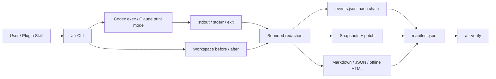

# Agent Flight Recorder

**Language:** English | [简体中文](README.zh-CN.md)

[](https://github.com/liao96312/agent-flight-recorder/actions/workflows/windows.yml)


Agent Flight Recorder (AFR) is a local-first flight recorder for CLI coding agents. It launches a new non-interactive Codex or Claude Code task, captures the evidence it can actually observe, redacts sensitive content before disk writes, and produces offline reports that can be verified later.

## Why AFR

Coding agents can change many files and emit long command traces. The final diff alone does not explain what ran, what failed, what was already dirty, or whether the saved evidence was modified afterward.

AFR provides a small, auditable loop:

1. Launch a new agent task through `afr run`.
2. Capture process output and workspace before/after state.
3. Redact known secrets before writing artifacts.
4. Generate Markdown, JSON, and offline HTML reports.
5. Verify the event hash chain and artifact manifest.

## Features

| Area | Capability |
| --- | --- |
| Agent wrapper | Preserves the child argv boundary and records exit, interruption, stdout, and stderr |
| Workspace evidence | Git and non-Git before/after snapshots, session delta, pre-existing changes, bounded patch |
| Privacy | Session-scoped HMAC placeholders and fail-closed handling for binary, unknown, or oversized records |
| Risk signals | Deterministic checks for visible destructive commands, secrets, privilege requests, network targets, and bulk changes |
| Integrity | Versioned JSONL event hash chain plus SHA-256 manifest for evidence and derived reports |
| Reports | `agent-flight.md`, `agent-risk.json`, and a single-file offline `report.html` |
| Operations | `list`, `show`, streaming `verify`, and preview-first `clean` |
| Integrations | One shared thin skill for Codex and Claude Code; no hooks, daemon, MCP server, or duplicated recorder logic |

## Architecture



## Quick Start

Requirements: Windows x64, Go 1.26, Git, and the agent CLI you want to run.

```powershell
git clone https://github.com/liao96312/agent-flight-recorder.git
Set-Location agent-flight-recorder
.\scripts\build.ps1 -Version 0.1.0
$afr = '.\dist\afr-windows-amd64.exe'
& $afr version
```

Record a new Codex task:

```powershell
& $afr run --workspace (Get-Location).Path -- codex exec --cd (Get-Location).Path "Inspect this repository without modifying files"
```

Or a new Claude Code task:

```powershell
& $afr run --workspace (Get-Location).Path -- claude --print "Inspect this repository without modifying files"
```

Inspect and verify the latest session:

```powershell
& $afr list
& $afr show latest
& $afr verify latest
& $afr clean --older-than 30d       # preview only
& $afr clean --older-than 30d --yes # delete the reviewed targets
```

See the copy-paste walkthrough in [Quick Start](docs/QUICKSTART.md).

## Codex And Claude Code Plugin

The shared plugin root is [`plugins/afr`](plugins/afr). It checks the local CLI, starts a **new recorded task**, and helps inspect or verify existing sessions. It cannot retroactively record the current conversation.

Local Codex marketplace test:

```powershell
codex plugin marketplace add .
codex plugin add afr@personal
```

Claude Code development load:

```powershell
claude --plugin-dir .\plugins\afr
# Then invoke /afr:afr
```

## Evidence Boundary

AFR verifies local consistency, not a digital signature or remote witness. A privileged local attacker can rewrite evidence and recompute hashes. The v0.1 wrapper does not claim native tool-event visibility, operating-system file monitoring, or network monitoring. Reports expose these gaps as `not_observable` instead of treating zero findings as proof of safety.

Read [Privacy And Threat Model](docs/SECURITY.md) before sharing a session directory.

## Verification

```powershell
go test ./...
.\scripts\release-check.ps1 -Full
```

The full release check covers the security matrix, 100 forced terminations, 100 concurrent output writers, the fixed 10,000-file benchmark, Windows build and checksum, and both plugin manifests.

## Repository Layout

```text
cmd/          afr CLI and deterministic fake agent
internal/     recorder, workspace evidence, redaction, risks, reports, verification
plugins/afr/  shared Codex and Claude Code plugin root
scripts/      build, benchmark, and release checks
docs/         plan, TODO, architecture, security, quick start, release checklist
.github/      Windows CI and artifact build
```

## Documentation

- [5-minute Quick Start](docs/QUICKSTART.md)
- [Privacy And Threat Model](docs/SECURITY.md)
- [Architecture (PlantUML)](docs/architecture.puml)
- [Project Plan](docs/PROJECT_PLAN.md)
- [Detailed TODO](docs/TODO.md)
- [v0.1 Release Checklist](docs/RELEASE_CHECKLIST.md)

## Status

The Windows x64 v0.1 core candidate is implemented and merged, but it is not a formal release yet. The remaining release gates are the bounded HTML event timeline, complete run summary, License decision, authenticated Claude smoke, clean-VM verification, public tag/Release, and download-back verification. Native hooks and broader platform services remain data-gated.
