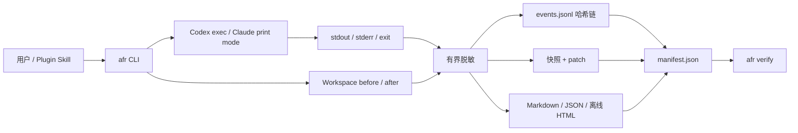

# Agent Flight Recorder

**语言：** [English](README.md) | 简体中文

[](https://github.com/liao96312/agent-flight-recorder/actions/workflows/windows.yml)
[](https://github.com/liao96312/agent-flight-recorder/actions/workflows/unix.yml)


[](LICENSE)

Agent Flight Recorder（AFR）是一个面向 CLI 编程智能体的本地优先飞行记录器。它通过包装器启动新的非交互式 Codex 或 Claude Code 任务，只采集真实可见的证据，在写盘前脱敏，并生成可离线查看和复核的报告。

## 为什么需要 AFR

编码智能体可能一次修改许多文件并产生很长的命令输出。最终 Diff 无法独立回答：运行了什么、哪里失败、哪些改动原本就存在，以及保存后的证据是否被修改。

AFR 提供一个小而完整的闭环：

1. 用 `afr run` 启动一个新的智能体任务。
2. 采集进程输出与工作区 before/after。
3. 已知敏感内容在写盘前脱敏。
4. 生成 Markdown、JSON 和离线 HTML 报告。
5. 校验事件哈希链与制品 manifest。

## 功能

| 范围 | 能力 |
| --- | --- |
| Agent 包装 | 保留 child argv 边界，记录退出、中断、stdout 与 stderr |
| 工作区证据 | Git / 非 Git 快照、session delta、pre-existing changes 和有界 patch |
| 隐私 | 会话级 HMAC 占位符；二进制、未知编码和超限记录 fail-closed |
| 风险信号 | 对可见的破坏性命令、secret、提权请求、网络目标和批量改动做确定性检查 |
| 完整性 | 版本化 JSONL 事件哈希链，以及 evidence / derived 制品 SHA-256 manifest |
| 报告 | `agent-flight.md`、`agent-risk.json`，以及带有界可筛选事件时间线的离线 `report.html` |
| 运维 | `list`、`show`、流式 `verify`、先预览后确认的 `clean` |
| 集成 | Codex / Claude Code 共用一个薄 skill；没有 hooks、daemon、MCP 或重复记录逻辑 |

## 架构



## 快速开始

前置：Windows x64、Go 1.26、Git，以及需要运行的 Agent CLI。

```powershell
git clone https://github.com/liao96312/agent-flight-recorder.git
Set-Location agent-flight-recorder
.\scripts\build.ps1 -Version 0.1.0
$afr = '.\dist\afr-windows-amd64.exe'
& $afr version
```

记录一个新的 Codex 任务：

```powershell
& $afr run --workspace (Get-Location).Path -- codex exec --cd (Get-Location).Path "只检查这个仓库，不要修改文件"
```

或记录一个新的 Claude Code 任务：

```powershell
& $afr run --workspace (Get-Location).Path -- claude --print "只检查这个仓库，不要修改文件"
```

查看和校验最新 session：

```powershell
& $afr list
& $afr show latest
& $afr show --open latest
& $afr verify latest
& $afr clean --older-than 30d       # 只预览
& $afr clean --older-than 30d --yes # 删除已确认目标
```

完整复制流程见 [5 分钟快速开始](docs/QUICKSTART.md)。

### 从工作区扫描中排除文件

如果生成目录或大文件不应进入 AFR 文件系统快照，请在工作区根目录添加 `.afrignore`：

```text
# 注释和空行会被忽略
vendor/
*.log
generated/*.tmp
```

普通路径是相对工作区根目录的路径前缀。包含 `*`、`?` 或 `[` 的模式在把 `\` 统一为 `/` 后使用 Go `path.Match` 规则，因此 `*.log` 只匹配工作区根目录。非法模式会在 child 启动前终止 `afr run`。这不是完整 `.gitignore`：不支持取反、递归 `**` 或向父目录查找配置。

## Codex 与 Claude Code 插件

共享插件根位于 [`plugins/afr`](plugins/afr)。它会检查本地 CLI、启动一个**新的被记录任务**，并帮助查看或校验已有 session；它不能追溯当前对话。

本地 Codex marketplace 测试：

```powershell
codex plugin marketplace add .
codex plugin add afr@personal
```

Claude Code 开发加载：

```powershell
claude --plugin-dir .\plugins\afr
# 然后调用 /afr:afr
```

## 证据边界

AFR 校验的是本地一致性，不是数字签名或远端见证。本机高权限攻击者可以同时改写证据并重算哈希。v0.1 wrapper 不声称能看到宿主原生工具事件，也不提供操作系统文件或网络监控；报告会把这些缺口明确标为 `not_observable`。

分享 session 目录前请阅读[隐私与威胁模型](docs/SECURITY.md)。

## 验证

```powershell
go test ./...
.\scripts\release-check.ps1 -Full
```

完整发布检查覆盖安全矩阵、100 次强制终止、100 路并发输出、固定 10,000 文件基准、Windows 构建与校验和，以及两个宿主的插件 manifest。GitHub CI 还会在 Windows、Ubuntu 和 macOS 上执行测试、构建、真实 `run` 与 `verify`。

## 仓库结构

```text
cmd/          afr CLI 与确定性 fake agent
internal/     记录、工作区证据、脱敏、风险、报告与校验
plugins/afr/  Codex / Claude Code 共享插件根
scripts/      构建、基准与发布检查
docs/         计划、TODO、架构、安全、快速开始与发布检查表
.github/      Windows artifact CI，以及 Ubuntu/macOS 测试与冒烟 CI
```

## 文档

- [5 分钟快速开始](docs/QUICKSTART.md)
- [隐私与威胁模型](docs/SECURITY.md)
- [架构（PlantUML）](docs/architecture.puml)
- [项目计划](docs/PROJECT_PLAN.md)
- [详细 TODO](docs/TODO.md)
- [v0.1 发布检查表](docs/RELEASE_CHECKLIST.md)

## 当前状态

v0.1 候选版现已包含 HTML 有界事件时间线、固定六行运行摘要，通过 Windows/Ubuntu/macOS CI，并采用 [MIT License](LICENSE)，但尚未正式发布。剩余门槛是已登录 Claude 冒烟、干净 VM 验证、最终候选一致性检查、公开 tag/Release 与回下载验证。Windows x64 仍是发布制品，Ubuntu 和 macOS 为 beta；原生 hooks 和更大的平台能力继续由真实数据门控制。
